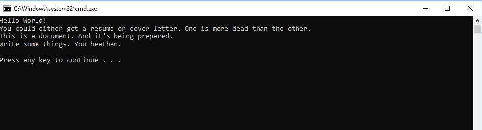

#Lab 42: Factory Method Design Pattern
One-liner: This is a Console app which follows factory design pattern. The main subject is on documents.

#Visuals
This is the Home page.

#Step by Step Directions
1. Upon opening the app, the user will be shown the home screen which will show what is happening to the document.
2. In the Program class, the input is Resume. So it is showing the choices of resume. Along with the Documentary factory. The creator is Kinkos. It creates.
3. If it were Cover letter, the choices would be similar since the choices are designed to be similar.